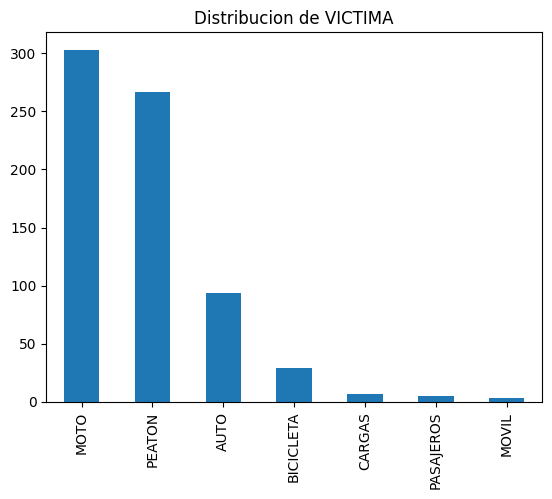
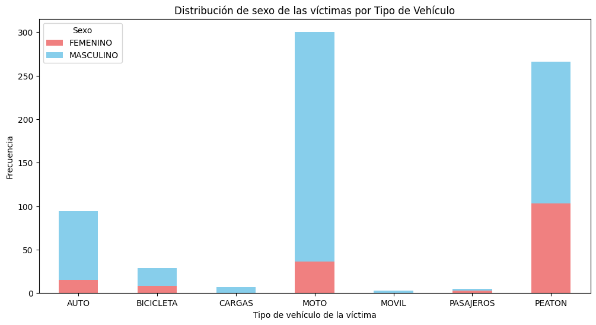
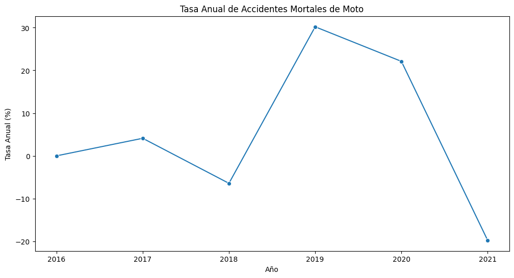
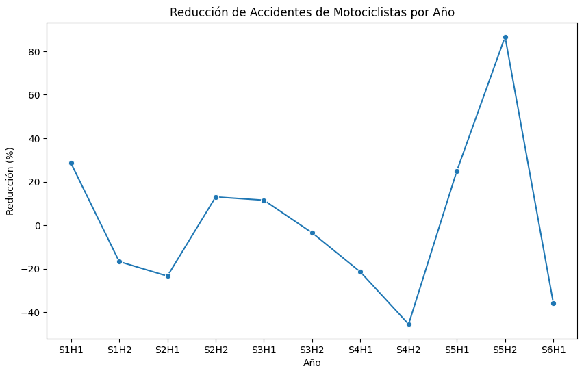

--- 
# Accidentes Viales
--- 

## Introducción:

Este repositorio contiene un análisis detallado de los accidentes de tránsito en la Ciudad Autónoma de Buenos Aires (CABA). A continuación, se presenta un resumen del informe y las recomendaciones clave basadas en el análisis de datos.

# Número de accidentes por tipo de victima: 

Se evidencia que las motocicletas representan la categoría con mayor incidencia de víctimas en homicidios de tránsito en la Ciudad Autónoma de Buenos Aires (CABA). Un dato igualmente preocupante es la presencia significativa de peatones como la segunda categoría con más víctimas, indicando una falta de concientización por parte de la ciudadanía en cuanto a la seguridad vial.

Este análisis refleja la necesidad urgente de implementar medidas y estrategias que aborden de manera específica los riesgos asociados a la conducción de motocicletas, así como también fortalecer iniciativas que promuevan la seguridad de los peatones. La alta incidencia de ambos grupos de víctimas resalta la importancia de crear conciencia sobre las normas de tránsito y fomentar un comportamiento seguro entre todos los actores viales.

--- 
# Accidentes por sexo 

Se observa una notable prevalencia de accidentes fatales en el género masculino. Este hallazgo sugiere que los hombres enfrentan un riesgo significativamente mayor de involucrarse en accidentes de tránsito con consecuencias fatales en comparación con otros géneros. Este patrón subraya la importancia de abordar de manera específica los comportamientos de riesgo y las circunstancias que contribuyen a esta disparidad de género. Es esencial desarrollar estrategias y campañas de concientización que se centren en la conducta segura y responsable de los conductores masculinos para reducir la incidencia de accidentes mortales y mejorar la seguridad vial de manera integral.

---

# Analisis Exploratorio de datos

Tasa anual de accidentes en motocilcetas: 

En este analisis, determinamos de forma preliminar los datos necesarios para la implementación en los KPI. Haciendo primero una tasa anual en los accidentes de motociclistas en Caba. 

## KPIs

# Reducción del 7% en accidentes mortales de motocicletas 

KPIs: Reducción del 7% en Accidentes Mortales de Motocicletas

Cálculo del KPI:
El KPI de "Reducción del 7% en accidentes mortales de motocicletas" se calculará de la siguiente manera:

Obtención de Datos:

1. Recopilación de datos históricos de accidentes de motocicletas, específicamente aquellos clasificados como "mortales".
Cálculo del Total de Accidentes Mortales de Motocicletas por Año:

2. Agregación de los datos para obtener el número total de accidentes mortales de motocicletas para cada año.
Aplicación del Descuento del 7%:

3. Calcular el 7% del total de accidentes mortales de motocicletas para cada año.
Determinación del Objetivo Reducido:

4. Restar el descuento del 7% del total original para establecer el objetivo de reducción.

# Estrategias Implementadas:

Para lograr la reducción del 7% en accidentes mortales de motocicletas, se implementarán las siguientes estrategias:

1. Campaña de Concientización Específica:

2. Diseñar y ejecutar una campaña de concientización centrada en motociclistas, destacando los riesgos específicos asociados a la conducción de motocicletas y promoviendo comportamientos seguros en la vía.

3. Mayor Presencia Policial en Zonas Críticas:

Aumentar la presencia policial en áreas identificadas como críticas para accidentes de motocicletas. Esto incluirá la implementación de controles de velocidad y operativos para detectar conductas riesgosas.

4. Incentivos para el Uso de Equipamiento de Seguridad:

Introducir incentivos para el uso obligatorio de cascos y otro equipamiento de seguridad por parte de los motociclistas. Estos incentivos podrían incluir descuentos en multas o beneficios fiscales.
Colaboración con Comunidades Motociclistas:

Establecer canales de diálogo y colaboración con comunidades motociclistas locales para comprender mejor sus necesidades y preocupaciones. Esto permitirá adaptar las estrategias de seguridad vial de manera más efectiva.

5. Monitoreo Continuo y Evaluación de Estrategias:

Implementar un sistema de monitoreo continuo para evaluar la efectividad de las estrategias implementadas. Se establecerán métricas específicas para medir el impacto y se realizarán ajustes según sea necesario.
La implementación de estas estrategias se realizará de manera colaborativa entre las autoridades de tránsito, fuerzas policiales, y organizaciones de seguridad vial. La mejora continua basada en el monitoreo y la retroalimentación será fundamental para alcanzar el objetivo de reducción del 7% en accidentes mortales de motocicletas.

Este es el resultado esperado de nuestro KPI. 
---

## KPIs: Reducción del 10% en la Tasa de Homicidios en Siniestros Viales

1. Métricas y KPI:
Tasa de Homicidios en Siniestros Viales:
Fórmula: (Número de homicidios en siniestros viales / Población total) * 100,000
Unidad: Homicidios por 100,000 habitantes
Periodo de Medición: Semestral
Objetivo KPI: Reducir esta tasa en un 10% respecto a la tasa del semestre anterior.

Estrategias Implementadas:
1. Análisis Detallado de Datos:

Realizar un análisis exhaustivo de los datos de accidentes de tránsito para identificar patrones, áreas críticas y factores de riesgo.

2. Campañas de Concientización Pública:

Diseñar e implementar campañas de concientización dirigidas a la comunidad para fomentar prácticas seguras en la conducción y conciencia sobre los riesgos de velocidad y conducción bajo la influencia.

3. Fiscalización y Aplicación Estricta de Leyes de Tránsito:

Reforzar la fiscalización de conductas peligrosas, como exceso de velocidad, conducción bajo sustancias y otras infracciones de tránsito. Aplicar sanciones más severas para disuadir comportamientos riesgosos.

4. Mejora de Infraestructuras y Señalización:

Evaluar y mejorar la infraestructura vial en áreas identificadas como críticas. Esto podría incluir mejoras en señalización, pasos de peatones y medidas para reducir la velocidad en zonas de alto riesgo.

5. Colaboración con Organizaciones de Seguridad Vial:

Colaborar con organizaciones de seguridad vial y expertos en movilidad para obtener asesoramiento y perspectivas adicionales sobre las mejores prácticas para la reducción de la tasa de homicidios en siniestros viales.

6. Monitoreo Continuo y Evaluación:

Establecer un sistema de monitoreo continuo para evaluar la efectividad de las estrategias implementadas. Evaluar la tasa de homicidios trimestralmente y ajustar las estrategias según sea necesario.

Evaluación del Desempeño:

1. Reducción del 10% en la Tasa de Homicidios:

Se considerará que el KPI se ha alcanzado si la tasa de homicidios en siniestros viales del último semestre es al menos un 10% menor que la del semestre anterior.

2. Feedback de la Comunidad y Expertos:

Se recopilará el feedback de la comunidad y expertos en seguridad vial para evaluar la percepción y efectividad de las estrategias implementadas.

3. Análisis de Causa y Efecto:

Se realizará un análisis en profundidad para entender las correlaciones entre las estrategias implementadas y los cambios observados en la tasa de homicidios en siniestros viales.

--- 
## Conclusiones generales: 

1. La concientización y educación son fundamentales para abordar las tendencias preocupantes en accidentes de tránsito, especialmente entre motociclistas y peatones.

2. Estrategias específicas para géneros pueden ser clave, dado el aumento de accidentes en el sexo masculino.

3. Las tasas anuales y el monitoreo continuo son herramientas esenciales para evaluar el impacto de las medidas implementadas.

Este informe sienta las bases para abordar la problemática de los accidentes viales en CABA, proporcionando un enfoque estratégico y basado en datos para mejorar la seguridad vial.
---
# Autor: 
Jordi Mikel Segarra Guerra
